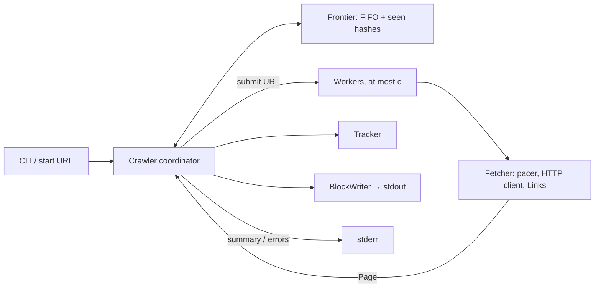

# Design

The Java crawler's behavior. [`e2e/cases.json`](../e2e/cases.json) tests observable behavior; [`e2e/urls.json`](../e2e/urls.json) tests URL rules.

## 1. CLI and output

```text
crawl [-f] [-v] [-c N] [-n N] [-t SECONDS] [-d SECONDS] <url>
```

| Flag         | Meaning                            | Default / range                                 |
| :----------- | :--------------------------------- | :---------------------------------------------- |
| `-f`         | Fast mode                          | Off; chooses machine concurrency and zero delay |
| `-v`         | Print settings to stderr           | Off                                             |
| `-c N`       | Fetches in flight                  | 1 / 1–256                                       |
| `-n N`       | Pages dispatched                   | 1,000 / at least 1                              |
| `-t SECONDS` | Timeout per URL                    | 10 / 1–120                                      |
| `-d SECONDS` | Delay between request starts       | 1 / 0–60                                        |
| `-h`, `-V`   | Help; version and direct libraries | Exit 0                                          |

CLI rules:

- Flags precede exactly one absolute HTTP(S) URL. Each flag is written alone; `-c8`, `-c=8` and `--c` are unknown. `--` ends flags.
- Numeric values are decimal digits with optional uppercase `K` or `M` (×1,000 or ×1,000,000). Repeated flags keep their last value.
- `-h` and `-V` succeed unless an earlier flag failed; `-h` and `-V` exit 1 when stdout cannot be written. Invalid usage prints one error line to stderr and exits 2 before connecting. The first error wins: unknown flag, missing value, invalid value or range, wrong URL count, invalid URL.
- Help derives each numeric default and range from its flag declaration. The `-f` switch describes its machine-sized concurrency and zero-delay overrides. The machine's CPU count honours both CPU affinity and cgroup quota.
- `SSL_CERT_FILE` replaces the system CA store with the named PEM file. An unreadable file prints one startup warning to stderr and trusts no certificates; an empty file also trusts no certificates.

Stdout has one line per completed page: `<url> [<status>] [error: <category>]`. A timeout or malformed response hides the status. A body that fails to decode is `malformed response`. Error categories are `timeout`, `connect failed`, `dns failed`, `tls failed`, `connection reset`, `malformed response` and `body over 5 MiB`.

After all page lines, stderr gets `crawled N pages in S.SSs, E errors`. HTTP statuses such as 404 do not count as errors.

| Exit      | Condition                                                                                     |
| :-------- | :-------------------------------------------------------------------------------------------- |
| 0         | Clean completion or reader closed stdout                                                      |
| 1         | Start page failed (error or status ≥ 400), dead host, output write failure or unhandled error |
| 2         | Usage error                                                                                   |
| 130 / 143 | SIGINT / SIGTERM after draining fetches                                                       |

- **Scope:** Only the start URL's host, regardless of scheme or port; subdomains are separate. Each canonical URL is fetched at most once.
- **Redirects:** The HTTP client never follows them. A 3xx page contributes only its first `Location` header, resolved against the page URL. Header bytes are interpreted as ISO-8859-1.
- **Request:** GET with `User-Agent: crawler/1.0`, `Accept: */*` and `Accept-Encoding: gzip, deflate`.

## 2. Coordinator

One coordinator owns the frontier, in-flight count, tracker and stdout. It dispatches queued URLs while workers are idle, the `-n` budget remains, and no signal or dead host has stopped dispatch. Workers return `Page` values. The coordinator records and prints each completion, then enqueues its links. A link rejected for page or queue capacity is **not** marked seen, so it may be accepted later.



- First SIGINT or SIGTERM: stop dispatch and drain in-flight fetches. Second signal: exit immediately. SIGPIPE is ignored; SIGHUP keeps its default action.
- Closed stdout reader: exit 0 or the signal code. Other write failure: exit 1 and report `error: cannot write output` after the summary.
- Dead host: report `error: host unreachable` before the summary, unless output failed.

## 3. Limits

| Resource                   | Cap                                                   |
| :------------------------- | :---------------------------------------------------- |
| In-flight fetches          | 256                                                                            |
| Decoded HTML body          | 5 MiB; a larger `Content-Length` on an uncompressed body fails before reading   |
| Distinct links from a page | 1,000 and 256 KiB of canonical URL bytes                                       |
| Canonical URL              | 8,000 bytes                                                                    |
| Frontier queue             | 128 MiB in 64 KiB chunks                                                       |
| Seen table                 | 64-bit hashes, at most 2²⁴ slots / 128 MiB                                     |

HTML is scanned as it arrives; no full body is retained. Queue entries pack a URL and may strip the start origin; read chunks are reclaimed. The seen table accepts at most 12,582,912 hashes (75% load); a collision can skip a URL. These limits allow 10 million pages within 1024 MB without lowering requested concurrency or page count.

## 4. Links and URL form

- Scan only 2xx `text/html` responses, excluding 204. The first `Content-Type` counts; its media type ignores case and parameters. Discard other bodies, including redirects.
- Decode gzip and deflate before the 5 MiB limit and UTF-8 scan; ignore the declared charset.

- Take the first `href` of each `<a>` start tag, in document order. Skip comments and the contents of `script`, `style`, `title` and `textarea`; `base`, `link` and `area` are not links.
- Decode HTML attribute quotes and character references; malformed UTF-8 becomes U+FFFD. A tag over 64 KiB yields no link.
- Omit duplicate resolved URLs. Stop before exceeding either link cap.

Every start URL, href and `Location` uses the WHATWG URL parser and serializer, then these crawler rules:

1. Accept only HTTP(S), with no username or password.
2. Resolve relative references against the page URL.
3. Remove the fragment and reject a serialized URL over 8,000 bytes.

The URL library carries the standard and IDNA conformance tests; `e2e/urls.json` holds these crawler-specific rules.

## 5. Network and resilience

- **Deadline and pacing:** The `-t` deadline begins **after the first pacer wait** and covers DNS, connect, TLS, retries and body reading. Default starts are at least one second apart. Fast mode defaults to zero delay; `-d` sets either mode's delay.
- **Retries:** At most four per URL (five attempts). Retry 408, 429, 502, 503 and 504, or a failure before a status line except timeout. Other statuses are final. Skip a retry whose wait cannot fit before the deadline.
- **Wait:** Use whole-second `Retry-After` when valid (first repeated value), otherwise jitter in ranges 0–250 ms, 0–500 ms, 0–1 s and 0–2 s. In polite mode the wait pushes the shared gate; in fast mode only that worker waits.
- **Dead host:** Five consecutive `connect failed` or `dns failed` pages stop new dispatches. Any other page resets the count.
- **Transport:** HTTP/1.1 connections may be reused; a stale pooled connection is retried. Connects directly; proxy variables are ignored. TLS uses 1.2 or 1.3 and X25519 then P-256 key exchange. HTTP/2 and HTTP/3 are not used. Invalid framing may be rejected or accepted by a lenient client, but must never hang or crash. Servers often close TLS without close_notify; framing (Content-Length or chunked) catches a cut body, and a close-delimited body is taken as sent.

## Diagrams

Source diagrams: [coordinator](diagrams/02-coordinator-loop.mmd), [frontier](diagrams/03-frontier-memory.mmd), [retries](diagrams/04-fetcher-resilience.mmd), [dead host](diagrams/05-dead-host-detection.mmd), [response](diagrams/06-http-response-pipeline.mmd), [links](diagrams/07-link-extraction-url-rules.mmd), [sequence](diagrams/08-sequence.mmd).
